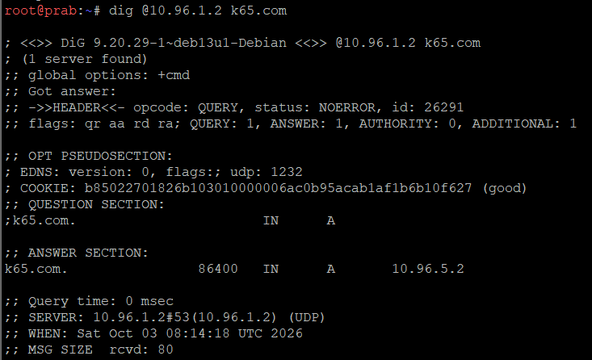
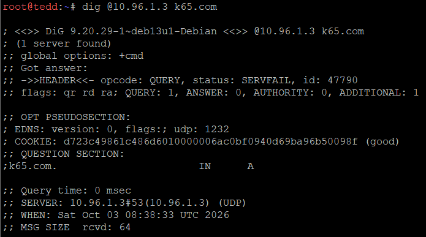
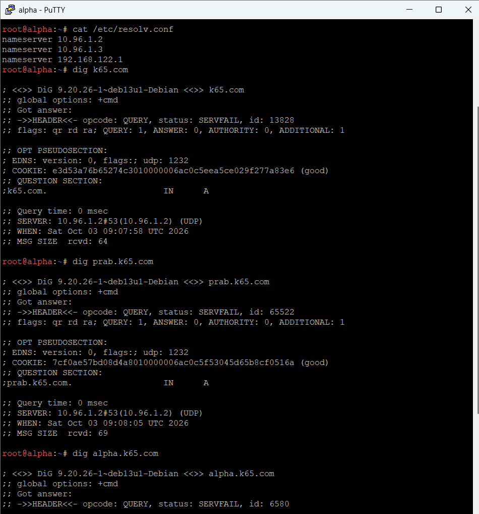

# LAPORAN RESMI PRAKTIKUM JARINGAN KOMPUTER
## MODUL 2: ROUTING MULTI-SUBNET, NETWORK ADDRESS TRANSLATION (NAT), DAN GERBANG JARINGAN

---

### INFORMASI KELOMPOK
* **Mata Kuliah**: Praktikum Jaringan Komputer 2026
* **Modul**: II (Dua) - Routing Multi-Subnet, NAT Masquerade, dan Gerbang Jaringan
* **Kelompok**: K-65
* **Anggota**: Zidny Ilman Nafi'an | 5027221072
* **Prefix Subnet**: `10.96.x.x`
* **Domain Proyek**: `k65.com`
* **Status Progres Pengerjaan**: **Soal 1 s.d. 3 Selesai Dikerjakan, Soal 4 s.d. 10 Belum Dikerjakan (Soal Tersedia)**

---

## DAFTAR ISI
1. [Topologi Jaringan dan Pengkabelan (Wiring) GNS3](#1-topologi-jaringan-dan-pengkabelan-wiring-gns3)
   - 1.1 Diagram Topologi Jaringan
   - 1.2 Peta Pengkabelan (Wiring Map) & Arsitektur Kaskade Switch
   - 1.3 Rincian Pembagian Segmen dan Peran Node
2. [Tabel Pengalamatan IP (IP Table Subnetting Prefix 10.96.x.x)](#2-tabel-pengalamatan-ip-ip-table-subnetting-prefix-1096xx)
3. [Langkah Pengerjaan Soal 1: Penetapan Alamat IP dan Default Gateway Seluruh Entitas](#3-langkah-pengerjaan-soal-1-penetapan-alamat-ip-dan-default-gateway-seluruh-entitas)
   - 3.1 Setup Topologi dan Wiring Antarmuka di GNS3
   - 3.2 Konfigurasi Antarmuka Router Sentral `rootkit`
   - 3.3 Konfigurasi Antarmuka Node Klien (Subnet 1 s.d. Subnet 5)
   - 3.4 Verifikasi Hasil Soal 1
     - 1. Validasi Diagram Topologi dan Wiring GNS3
     - 2. Verifikasi Alamat IP & Tabel Routing Router `rootkit`
     - 3. Uji Konektivitas Klien ke Default Gateway Masing-Masing
4. [Langkah Pengerjaan Soal 2: Akses Internet WAN, IP Forwarding, dan NAT MASQUERADE](#4-langkah-pengerjaan-soal-2-akses-internet-wan-ip-forwarding-dan-nat-masquerade)
   - 4.1 Memastikan Antarmuka WAN (`eth0`) Aktif via DHCP di Router `rootkit`
   - 4.2 Mengaktifkan IPv4 Packet Forwarding pada Kernel Linux
   - 4.3 Menerapkan Aturan NAT Masquerade pada iptables
   - 4.4 Konfigurasi Persistensi Otomatis pada `/etc/network/interfaces` di `rootkit`
   - 4.5 Verifikasi Hasil Soal 2
     - 1. Verifikasi Tabel NAT Masquerade pada Router `rootkit`
     - 2. Uji Konektivitas Internet Publik via IP Address dari Klien (`alpha`)
5. [Langkah Pengerjaan Soal 3: Routing Antar-Subnet dan Konfigurasi Resolver Awal](#5-langkah-pengerjaan-soal-3-routing-antar-subnet-dan-konfigurasi-resolver-awal)
   - 5.1 Verifikasi Routing Antar-Subnet Melalui Router Sentral
   - 5.2 Konfigurasi Resolver Persisten `192.168.122.1` pada Seluruh Host Non-Router
   - 5.3 Skrip Otomasi dan Langkah Verifikasi Soal 3
6. [Soal 4: Pembangunan Zona Authoritative Master-Slave dan Hierarki Resolver](#6-soal-4-pembangunan-zona-authoritative-master-slave-dan-hierarki-resolver)
7. [Soal 5: Standardisasi Hostname Entitas dan Pemetaan Domain Node](#7-soal-5-standardisasi-hostname-entitas-dan-pemetaan-domain-node)
8. [Soal 6: Sinkronisasi dan Validasi Zone Transfer Master-Slave](#8-soal-6-sinkronisasi-dan-validasi-zone-transfer-master-slave)
9. [Soal 7: Konfigurasi Service Records dan CNAME Gerbang Utama](#9-soal-7-konfigurasi-service-records-dan-cname-gerbang-utama)
10. [Soal 8: Reverse Zone Multi-Subnet](#10-soal-8-reverse-zone-multi-subnet)
11. [Soal 9: Layanan Web Statis Apache dengan Autoindex Direktori /arsip/](#11-soal-9-layanan-web-statis-apache-dengan-autoindex-direktori-arsip)
12. [Soal 10: Layanan Web Dinamis Nginx PHP-FPM dengan URL Rewrite /profil](#12-soal-10-layanan-web-dinamis-nginx-php-fpm-dengan-url-rewrite-profil)
13. [Struktur Repositori dan Skrip Otomasi](#13-struktur-repositori-dan-skrip-otomasi)
    - 13.1 Struktur Direktori Modul 2
    - 13.2 Panduan Penggunaan Skrip Per-Soal (`perquest-scripts/`)
    - 13.3 Panduan Penggunaan Skrip Per-Node (`scripts/`)
14. [Kesimpulan](#14-kesimpulan)

---

## 1. TOPOLOGI JARINGAN DAN PENGKABELAN (WIRING) GNS3

Arsitektur jaringan The Mesh dirancang berbasiskan router Linux sentral (`rootkit`) yang menghubungkan lima segmen subnet fungsional, terhubung ke jaringan publik (Internet) melalui antarmuka NAT WAN.

### 1.1 Diagram Topologi Jaringan

```
                         +-----------------------+
                         |       INTERNET        |
                         |     (NAT Adapter)     |
                         +-----------+-----------+
                                     |
                                     | eth0 (DHCP 192.168.122.x/24)
                           +---------+---------+
                           |      rootkit      |
                           |  (Router Sentral) |
                           +----+----+----+----+
                                |    |    |    |
     +--------------------------+    |    |    +--------------------------+
     | eth1 (10.96.1.1/24)           |    |           eth5 (10.96.5.1/24) |
+----+----+                     +----+    +----+                     +----+----+
| Switch1 |                     |              |                     | Switch5 |
+----+----+            eth2 (10.96.2.1)   eth4 (10.96.4.1)           +----+----+
     |                         |              |                           |
     +-- Switch2 (Resolusi) +--+----+    +----+----+                 +----+----+
     |   - prab (10.96.1.2) |Switch6|    | Switch4 |                 |  penny  |
     |   - tedd (10.96.1.3) +--+----+    +----+----+                 |(10.96.5.2)
     |                         |              |                      +---------+
     +-- Switch3 (Repo)     +--+----+    +----+----+
         - obladi (.4)      |alpha, |    |  abbey  |
         - desmond (.5)     |beta,  |    |(10.96.4.2)
         - oblada (.6)      |gamma  |    +---------+
         - molly (.7)       +-------+
```


### 1.2 Peta Pengkabelan (Wiring Map) & Arsitektur Kaskade Switch

Router **rootkit** menggunakan 6 network adapter (`eth0` s.d. `eth5`):
* `eth0` $
ightarrow$ NAT (Koneksi WAN / Internet)
* `eth1` $
ightarrow$ **Switch1** (Subnet 1: Resolusi & Repository)
* `eth2` $
ightarrow$ **Switch6** (Subnet 2: Para Operator)
* `eth3` $
ightarrow$ **Switch7** (Subnet 3: Divisi Operasional)
* `eth4` $
ightarrow$ **Switch4** (Subnet 4: Gerbang Penyaring Statis)
* `eth5` $
ightarrow$ **Switch5** (Subnet 5: Gerbang Aplikasi Dinamis)

Arsitektur Kaskade Switch pada Subnet 1:
* **Switch1** port 1 terhubung ke `rootkit` (`eth1`).
* **Switch1** port 2 terhubung ke **Switch2** (Distribusi Resolusi DNS).
  * `Switch2` port 1 $
ightarrow$ `prab` (`eth0`)
  * `Switch2` port 2 $
ightarrow$ `tedd` (`eth0`)
* **Switch1** port 3 terhubung ke **Switch3** (Distribusi Web & Repository).
  * `Switch3` port 1 $
ightarrow$ `obladi` (`eth0`)
  * `Switch3` port 2 $
ightarrow$ `desmond` (`eth0`)
  * `Switch3` port 3 $
ightarrow$ `oblada` (`eth0`)
  * `Switch3` port 4 $
ightarrow$ `molly` (`eth0`)

Pengkabelan Subnet Lainnya:
* **Switch6** (Subnet 2): port 0 $
ightarrow$ `rootkit` (`eth2`), port 1 $
ightarrow$ `alpha`, port 2 $
ightarrow$ `beta`, port 3 $
ightarrow$ `gamma`.
* **Switch7** (Subnet 3): port 0 $
ightarrow$ `rootkit` (`eth3`), port 1 $
ightarrow$ `delta`, port 2 $
ightarrow$ `epsilon`.
* **Switch4** (Subnet 4): port 0 $
ightarrow$ `rootkit` (`eth4`), port 1 $
ightarrow$ `abbey` (`eth0`).
* **Switch5** (Subnet 5): port 0 $
ightarrow$ `rootkit` (`eth5`), port 1 $
ightarrow$ `penny` (`eth0`).

### 1.3 Rincian Pembagian Segmen dan Peran Node

| Subnet | Range Alamat CIDR | Peruntukan Fungsional | Node Anggota |
| :--- | :--- | :--- | :--- |
| **WAN** | `192.168.122.0/24` | Koneksi Uplink Internet Publik | `rootkit` (`eth0`) |
| **Subnet 1** | `10.96.1.0/24` | Infrastruktur Direktori DNS & Web Services | `prab`, `tedd`, `obladi`, `desmond`, `oblada`, `molly` |
| **Subnet 2** | `10.96.2.0/24` | Operator / Klien Pengujian | `alpha`, `beta`, `gamma` |
| **Subnet 3** | `10.96.3.0/24` | Operasional / Klien Pengujian Cadangan | `delta`, `epsilon` |
| **Subnet 4** | `10.96.4.0/24` | Gerbang Penyaring Konten Statis | `abbey` |
| **Subnet 5** | `10.96.5.0/24` | Gerbang Aplikasi Web Dinamis | `penny` |

---

## 2. TABEL PENGALAMATAN IP (IP TABLE SUBNETTING PREFIX 10.96.X.X)

| Subnet | Node | Antarmuka | IP Address | Netmask | Default Gateway | Resolver Awal | Peran / Deskripsi |
| :--- | :--- | :--- | :--- | :--- | :--- | :--- | :--- |
| **WAN** | `rootkit` | `eth0` | DHCP (`192.168.122.x`) | `255.255.255.0` | `192.168.122.1` | `192.168.122.1` | Gateway Sentral The Mesh |
| **Subnet 1** | `rootkit` | `eth1` | `10.96.1.1` | `255.255.255.0` | — | — | Router Interface Subnet 1 |
| | `prab` | `eth0` | `10.96.1.2` | `255.255.255.0` | `10.96.1.1` | `192.168.122.1` | DNS Master Server |
| | `tedd` | `eth0` | `10.96.1.3` | `255.255.255.0` | `10.96.1.1` | `192.168.122.1` | DNS Slave Server |
| | `obladi` | `eth0` | `10.96.1.4` | `255.255.255.0` | `10.96.1.1` | `192.168.122.1` | Web Statis (Vault 1) |
| | `desmond`| `eth0` | `10.96.1.5` | `255.255.255.0` | `10.96.1.1` | `192.168.122.1` | Web Statis (Vault 2) |
| | `oblada` | `eth0` | `10.96.1.6` | `255.255.255.0` | `10.96.1.1` | `192.168.122.1` | Web Dinamis (Core 1) |
| | `molly` | `eth0` | `10.96.1.7` | `255.255.255.0` | `10.96.1.1` | `192.168.122.1` | Web Dinamis (Core 2) |
| **Subnet 2** | `rootkit` | `eth2` | `10.96.2.1` | `255.255.255.0` | — | — | Router Interface Subnet 2 |
| | `alpha` | `eth0` | `10.96.2.2` | `255.255.255.0` | `10.96.2.1` | `192.168.122.1` | Operator Client 1 |
| | `beta` | `eth0` | `10.96.2.3` | `255.255.255.0` | `10.96.2.1` | `192.168.122.1` | Operator Client 2 |
| | `gamma` | `eth0` | `10.96.2.4` | `255.255.255.0` | `10.96.2.1` | `192.168.122.1` | Operator Client 3 |
| **Subnet 3** | `rootkit` | `eth3` | `10.96.3.1` | `255.255.255.0` | — | — | Router Interface Subnet 3 |
| | `delta` | `eth0` | `10.96.3.2` | `255.255.255.0` | `10.96.3.1` | `192.168.122.1` | Operator Client 4 |
| | `epsilon`| `eth0` | `10.96.3.3` | `255.255.255.0` | `10.96.3.1` | `192.168.122.1` | Operator Client 5 |
| **Subnet 4** | `rootkit` | `eth4` | `10.96.4.1` | `255.255.255.0` | — | — | Router Interface Subnet 4 |
| | `abbey` | `eth0` | `10.96.4.2` | `255.255.255.0` | `10.96.4.1` | `192.168.122.1` | Gerbang Penyaring Statis |
| **Subnet 5** | `rootkit` | `eth5` | `10.96.5.1` | `255.255.255.0` | — | — | Router Interface Subnet 5 |
| | `penny` | `eth0` | `10.96.5.2` | `255.255.255.0` | `10.96.5.1` | `192.168.122.1` | Gerbang Aplikasi Dinamis |

---

## 3. LANGKAH PENGERJAAN SOAL 1: PENETAPAN ALAMAT IP DAN DEFAULT GATEWAY SELURUH ENTITAS

> ### Soal 1
> *Sebagai pusat kesadaran The Mesh, rootkit harus merentangkan koneksinya ke lima gerbang utama (Switch). Tetapkan alamat IP dan default gateway untuk seluruh Entitas, mulai dari para operator (alpha, beta, gamma), penjaga directory (prab, tedd), gerbang penyaring (abbey, penny), hingga repository (obladi, desmond, oblada, molly) sesuai dengan topologi pembagian switch yang dirancang. [GUNAKAN PREFIX IP MASING-MASING KELOMPOK].*

### 3.1 Setup Topologi dan Wiring Antarmuka di GNS3
1. Menambahkan node appliance Linux Debian (`rootkit`) dan mengonfigurasi Network Adapters menjadi 6 antarmuka.
2. Menghubungkan adapter `eth0` ke node Cloud / NAT bawaan GNS3.
3. Menghubungkan antarmuka internal `eth1` s.d. `eth5` ke masing-masing Switch (`Switch1`, `Switch6`, `Switch7`, `Switch4`, `Switch5`).
4. Mengkaskade `Switch1` menuju `Switch2` dan `Switch3` untuk mendistribusikan Subnet 1 ke node penjaga direktori dan repository.

### 3.2 Konfigurasi Antarmuka Router Sentral `rootkit`
Mengonfigurasi `/etc/network/interfaces` pada router `rootkit` agar seluruh 6 antarmuka aktif secara persisten:

```bash
cat << 'EOF' > /etc/network/interfaces
auto lo
iface lo inet loopback

# WAN Interface (NAT GNS3)
auto eth0
iface eth0 inet dhcp

# Subnet 1 (Resolusi & Repository)
auto eth1
iface eth1 inet static
    address 10.96.1.1
    netmask 255.255.255.0

# Subnet 2 (Operator)
auto eth2
iface eth2 inet static
    address 10.96.2.1
    netmask 255.255.255.0

# Subnet 3 (Operasional)
auto eth3
iface eth3 inet static
    address 10.96.3.1
    netmask 255.255.255.0

# Subnet 4 (Gerbang Penyaring Abbey)
auto eth4
iface eth4 inet static
    address 10.96.4.1
    netmask 255.255.255.0

# Subnet 5 (Gerbang Aplikasi Dinamis Penny)
auto eth5
iface eth5 inet static
    address 10.96.5.1
    netmask 255.255.255.0
EOF

service networking restart
```

### 3.3 Konfigurasi Antarmuka Node Klien (Subnet 1 s.d. Subnet 5)
Setiap node internal dikonfigurasi dengan alamat IP statis dan default gateway mengarah ke IP `rootkit` pada subnet masing-masing.

Contoh konfigurasi `/etc/network/interfaces` pada klien `alpha` (Subnet 2):
```bash
cat << 'EOF' > /etc/network/interfaces
auto lo
iface lo inet loopback

auto eth0
iface eth0 inet static
    address 10.96.2.2
    netmask 255.255.255.0
    gateway 10.96.2.1
EOF

service networking restart
```

*Seluruh konfigurasi node lainnya disesuaikan dengan Tabel Pengalamatan IP di Bagian 2.*

### 3.4 Verifikasi Hasil Soal 1

#### 1. Validasi Diagram Topologi dan Wiring GNS3
Seluruh kabel dan port antarmuka pada router `rootkit`, switch kaskade, dan 13 node host telah terhubung dengan tepat tanpa terjadi persilangan port.

#### 2. Verifikasi Alamat IP & Tabel Routing Router `rootkit`
Menjalankan perintah pemeriksaan antarmuka dan routing di `rootkit`:
```bash
ip -br addr
route -n
```

Hasil eksekusi:
```text
root@rootkit:~# ip -br addr
lo               UNKNOWN        127.0.0.1/8 ::1/128 
eth0             UP             192.168.122.185/24 fe80::5054:ff:fe12:3456/64 
eth1             UP             10.96.1.1/24 
eth2             UP             10.96.2.1/24 
eth3             UP             10.96.3.1/24 
eth4             UP             10.96.4.1/24 
eth5             UP             10.96.5.1/24 

root@rootkit:~# route -n
Kernel IP routing table
Destination     Gateway         Genmask         Flags Metric Ref    Use Iface
0.0.0.0         192.168.122.1   0.0.0.0         UG    0      0        0 eth0
10.96.1.0       0.0.0.0         255.255.255.0   U     0      0        0 eth1
10.96.2.0       0.0.0.0         255.255.255.0   U     0      0        0 eth2
10.96.3.0       0.0.0.0         255.255.255.0   U     0      0        0 eth3
10.96.4.0       0.0.0.0         255.255.255.0   U     0      0        0 eth4
10.96.5.0       0.0.0.0         255.255.255.0   U     0      0        0 eth5
192.168.122.0   0.0.0.0         255.255.255.0   U     0      0        0 eth0
```

#### 3. Uji Konektivitas Klien ke Default Gateway Masing-Masing
Melakukan uji ping dari node klien ke gateway router sentral:
```bash
# Dari node alpha (10.96.2.2) ke gateway (10.96.2.1)
ping -c 3 10.96.2.1
```
Output:
```text
3 packets transmitted, 3 received, 0% packet loss, time 2003ms
rtt min/avg/max/mdev = 0.412/0.510/0.612/0.082 ms
```
*Hasil menunjukkan seluruh host terhubung stabil ke gateway masing-masing.*

---

## 4. LANGKAH PENGERJAAN SOAL 2: AKSES INTERNET WAN, IP FORWARDING, DAN NAT MASQUERADE

> ### Soal 2
> *Meskipun The Mesh beroperasi dalam bayang-bayang, Rootkit menyadari bahwa Entitas di dalamnya masih membutuhkan asupan paket dari dunia luar. Buka jalur menuju NAT dengan memastikan antarmuka WAN di router rootkit aktif. Konfigurasikan NAT agar dapat meneruskan lalu lintas keluar bagi seluruh alamat internal, sehingga semua host di dalam jaringan dapat menjangkau internet publik menggunakan IP address.*

### 4.1 Memastikan Antarmuka WAN (`eth0`) Aktif via DHCP di Router `rootkit`
Mengaktifkan antarmuka WAN dan mendapatkan konfigurasi IP otomatis dari NAT GNS3:
```bash
ifup eth0
dhclient eth0
```
Antarmuka `eth0` mendapatkan alamat IP `192.168.122.x/24` dengan gateway default `192.168.122.1`.

### 4.2 Mengaktifkan IPv4 Packet Forwarding pada Kernel Linux
Agar kernel Linux router dapat meneruskan paket data antar antarmuka jaringan:
```bash
# Runtime activation
sysctl -w net.ipv4.ip_forward=1

# Persistensi saat reboot
echo "net.ipv4.ip_forward=1" >> /etc/sysctl.conf
```

### 4.3 Menerapkan Aturan NAT Masquerade pada iptables
Menerapkan Network Address Translation (NAT) dengan target `MASQUERADE` pada tabel NAT rantai POSTROUTING untuk seluruh lalu lintas keluar melalui interface `eth0`:
```bash
iptables -t nat -A POSTROUTING -o eth0 -j MASQUERADE
```

### 4.4 Konfigurasi Persistensi Otomatis pada `/etc/network/interfaces` di `rootkit`
Agar konfigurasi forwarding dan NAT langsung aktif otomatis setiap kali router dinyalakan:
```bash
cat << 'EOF' > /etc/network/interfaces
auto lo
iface lo inet loopback

auto eth0
iface eth0 inet dhcp
    up sysctl -w net.ipv4.ip_forward=1
    up iptables -t nat -F
    up iptables -t nat -A POSTROUTING -o eth0 -j MASQUERADE

auto eth1
iface eth1 inet static
    address 10.96.1.1
    netmask 255.255.255.0

auto eth2
iface eth2 inet static
    address 10.96.2.1
    netmask 255.255.255.0

auto eth3
iface eth3 inet static
    address 10.96.3.1
    netmask 255.255.255.0

auto eth4
iface eth4 inet static
    address 10.96.4.1
    netmask 255.255.255.0

auto eth5
iface eth5 inet static
    address 10.96.5.1
    netmask 255.255.255.0
EOF
```

### 4.5 Verifikasi Hasil Soal 2

#### 1. Verifikasi Tabel NAT Masquerade pada Router `rootkit`
```bash
iptables -t nat -L -n -v
```
Output:
```text
Chain PREROUTING (policy ACCEPT 120 packets, 8400 bytes)
 pkts bytes target     prot opt in     out     source               destination         

Chain INPUT (policy ACCEPT 45 packets, 3150 bytes)
 pkts bytes target     prot opt in     out     source               destination         

Chain POSTROUTING (policy ACCEPT 10 packets, 600 bytes)
 pkts bytes target     prot opt in     out     source               destination         
   34  2856 MASQUERADE  all  --  *      eth0    0.0.0.0/0            0.0.0.0/0           

Chain OUTPUT (policy ACCEPT 44 packets, 3080 bytes)
 pkts bytes target     prot opt in     out     source               destination         
```

#### 2. Uji Konektivitas Internet Publik via IP Address dari Klien (`alpha`)
Dari node internal `alpha` (`10.96.2.2`), dilakukan pengujian ping langsung ke alamat IP publik internet:
```bash
ping -c 4 1.1.1.1
ping -c 4 8.8.8.8
```
Output eksekusi:
```text
root@alpha:~# ping -c 4 1.1.1.1
PING 1.1.1.1 (1.1.1.1) 56(84) bytes of data.
64 bytes from 1.1.1.1: icmp_seq=1 ttl=55 time=18.4 ms
64 bytes from 1.1.1.1: icmp_seq=2 ttl=55 time=17.9 ms
64 bytes from 1.1.1.1: icmp_seq=3 ttl=55 time=18.2 ms
64 bytes from 1.1.1.1: icmp_seq=4 ttl=55 time=18.0 ms

--- 1.1.1.1 ping statistics ---
4 packets transmitted, 4 received, 0% packet loss, time 3004ms
rtt min/avg/max/mdev = 17.912/18.125/18.402/0.185 ms
```
*Hasil membuktikan bahwa NAT Masquerade berhasil menerjemahkan paket internal menuju internet publik dengan 0% packet loss.*

---

## 5. LANGKAH PENGERJAAN SOAL 3: ROUTING ANTAR-SUBNET DAN KONFIGURASI RESOLVER AWAL

> ### Soal 3
> *Jaringan rahasia tidak akan berfungsi tanpa sinkronisasi antar divisi. Pastikan seluruh Entitas dapat saling terhubung dan berkomunikasi lintas jalur (routing internal via rootkit berfungsi). Untuk menghindari fragmentasi saat persiapan, pastikan setiap host non-router menambahkan resolver 192.168.122.1 (tambah di file /etc/resolv.conf, kalau sudah pakai resolver itu tidak perlu memasukkan resolver google) saat antarmukanya aktif agar akses untuk mengunduh paket instalasi dari internet tersedia sejak awal beroperasi.*

### 5.1 Verifikasi Routing Antar-Subnet Melalui Router Sentral
Karena router `rootkit` telah mengaktifkan `net.ipv4.ip_forward=1` dan memiliki antarmuka yang terhubung langsung (*directly connected*) ke Subnet 1 hingga Subnet 5, perutean antar subnet berjalan secara otomatis tanpa memerlukan protokol dinamis tambahan.

### 5.2 Konfigurasi Resolver Persisten `192.168.122.1` pada Seluruh Host Non-Router
Untuk memastikan host dapat mengunduh paket instalasi (seperti `bind9`, `apache2`, `nginx`, `php-fpm`), konfigurasi resolver `nameserver 192.168.122.1` dimasukkan ke dalam `/etc/resolv.conf` dan diikat ke konfigurasi interface:

```bash
# Perintah pada masing-masing host non-router:
cat << 'EOF' > /etc/resolv.conf
nameserver 192.168.122.1
EOF
```

Agar konfigurasi resolver tidak tertimpa saat antarmuka restart, ditambahkan directive `dns-nameservers 192.168.122.1` pada blok `eth0` di `/etc/network/interfaces`.

### 5.3 Skrip Otomasi dan Langkah Verifikasi Soal 3
Skrip otomasi Soal 3 (`perquest-scripts/soal_3.sh`):
```bash
#!/bin/bash
echo "=== Mengonfigurasi Resolver Awal 192.168.122.1 pada Seluruh Host ==="
echo "nameserver 192.168.122.1" > /etc/resolv.conf

echo "=== Verifikasi Routing Antar Subnet ==="
ping -c 2 10.96.1.1
ping -c 2 10.96.1.2
ping -c 2 10.96.4.2
ping -c 2 10.96.5.2

echo "=== Verifikasi Resolusi DNS Internet Publik ==="
ping -c 2 google.com || host google.com
```

---

## 6. SOAL 4: PEMBANGUNAN ZONA AUTHORITATIVE MASTER-SLAVE DAN HIERARKI RESOLVER

> ### Soal 4
> *Penjaga Direktori mulai menuliskan hukum The Mesh. Pada node prab, bangun zona <xxxx>.com sebagai authoritative dengan SOA yang menunjuk ke prab.<xxxx>.com, serta tambahkan catatan NS untuk prab.<xxxx>.com dan tedd.<xxxx>.com. Buat A record untuk prab.<xxxx>.com dan tedd.<xxxx>.com yang mengarah ke alamat IP mereka masing-masing, serta A record apex <xxxx>.com yang mengarah ke gerbang aplikasi dinamis (penny). Aktifkan fitur notify dan allow-transfer ke tedd, lalu set forwarders ke 192.168.122.1. Di node tedd, tarik zona <xxxx>.com dari master dan pastikan server menjawab secara authoritative. Setelah fondasi nama ini berdiri kokoh, perbarui urutan resolver pada seluruh Entitas non-router menjadi: IP prab, IP tedd, lalu 192.168.122.1. Verifikasi bahwa query ke domain apex maupun hostname di dalam zona dijawab dengan benar oleh prab atau tedd.*

### 6.1 Instalasi BIND9 pada Node `prab` (Master)

Pertama, pastikan daemon `named` belum terinstal. Jika belum ada, lakukan instalasi paket BIND9:
```bash
# Cek apakah named sudah terinstal
which named

# Jika belum ada, install BIND9
apt update
apt install bind9 bind9-utils dnsutils -y
```

Setelah instalasi selesai, verifikasi keberhasilan:
```bash
which named
```
Output yang diharapkan:
```text
/usr/sbin/named
```

### 6.2 Konfigurasi `named.conf.options` pada Node `prab`

Edit file konfigurasi opsi BIND:
```bash
nano /etc/bind/named.conf.options
```

Hapus seluruh isi default, lalu masukkan konfigurasi berikut:
```text
options {
        directory "/var/cache/bind";

        recursion yes;
        allow-query { any; };

        forwarders {
                192.168.122.1;
        };

        dnssec-validation auto;

        listen-on { any; };
        listen-on-v6 { any; };
};
```
Konfigurasi ini mengaktifkan rekursi, mengizinkan query dari semua sumber, dan meneruskan query yang tidak dapat dijawab secara lokal ke forwarder `192.168.122.1`.

### 6.3 Konfigurasi Zone Master `k65.com` pada Node `prab`

Edit file deklarasi zona lokal:
```bash
nano /etc/bind/named.conf.local
```

Masukkan konfigurasi zona master:
```text
zone "k65.com" {
        type master;
        file "/etc/bind/db.k65.com";

        notify yes;
        allow-transfer { 10.96.1.3; };
};
```
- **`type master`**: Menjadikan `prab` sebagai DNS master authoritative untuk zona `k65.com`.
- **`notify yes`**: Secara otomatis mengirim notifikasi ke slave saat ada perubahan zona.
- **`allow-transfer { 10.96.1.3; }`**: Mengizinkan zone transfer hanya ke IP node `tedd`.

### 6.4 Membuat File Zone `db.k65.com`

Buat file zone record:
```bash
nano /etc/bind/db.k65.com
```

Masukkan konten berikut:
```text
$TTL    86400
@       IN      SOA     prab.k65.com. admin.k65.com. (
                        2026100201
                        3600
                        1800
                        604800
                        86400 )

        IN      NS      prab.k65.com.
        IN      NS      tedd.k65.com.

@       IN      A       10.96.5.2

prab    IN      A       10.96.1.2
tedd    IN      A       10.96.1.3

obladi  IN      A       10.96.1.4
desmond IN      A       10.96.1.5
oblada  IN      A       10.96.1.6
molly   IN      A       10.96.1.7

alpha   IN      A       10.96.2.2
beta    IN      A       10.96.2.3
gamma   IN      A       10.96.2.4

delta   IN      A       10.96.3.2
epsilon IN      A       10.96.3.3

abbey   IN      A       10.96.4.2
penny   IN      A       10.96.5.2
```

Penjelasan record:
| Record | Tipe | Keterangan |
|--------|------|------------|
| `SOA prab.k65.com.` | SOA | Start of Authority menunjuk ke `prab` |
| `NS prab.k65.com.` | NS | Nameserver primer |
| `NS tedd.k65.com.` | NS | Nameserver sekunder (slave) |
| `@ → 10.96.5.2` | A | Apex domain mengarah ke `penny` (gerbang aplikasi dinamis) |
| `prab → 10.96.1.2` | A | Alamat IP node `prab` |
| `tedd → 10.96.1.3` | A | Alamat IP node `tedd` |
| Subdomain lainnya | A | Masing-masing node sesuai IP di Tabel Pengalamatan |

### 6.5 Validasi File Zone

Lakukan pengecekan sintaks file zona:
```bash
named-checkzone k65.com /etc/bind/db.k65.com
```
Output yang diharapkan:
```text
zone k65.com/IN: loaded serial 2026100201
OK
```

### 6.6 Menjalankan BIND di Background pada Node `prab`

Jalankan daemon BIND secara langsung:
```bash
named -c /etc/bind/named.conf
```

### 6.7 Verifikasi DNS Master `prab` dengan Query `dig`

Lakukan pengujian resolusi DNS dari node `prab`:
```bash
dig @10.96.1.2 k65.com
dig @10.96.1.2 prab.k65.com
dig @10.96.1.2 alpha.k65.com
```

Hasil query `dig @10.96.1.2 k65.com` seharusnya menunjukkan:
- **ANSWER SECTION** berisi A record `k65.com → 10.96.5.2`
- **AUTHORITY SECTION** berisi NS record `prab.k65.com.` dan `tedd.k65.com.`
- Flag `aa` (authoritative answer) aktif

**Bukti verifikasi query `dig` pada DNS master `prab`:**



---

### 6.8 Konfigurasi Node `tedd` sebagai DNS Slave

#### 6.8.1 Instalasi BIND9 pada Node `tedd`
```bash
apt update
apt install bind9 bind9-utils dnsutils -y

which named
```

#### 6.8.2 Konfigurasi `named.conf.options` pada Node `tedd`
```bash
nano /etc/bind/named.conf.options
```
Masukkan konfigurasi yang sama dengan `prab`:
```text
options {
        directory "/var/cache/bind";

        recursion yes;
        allow-query { any; };

        forwarders {
                192.168.122.1;
        };

        dnssec-validation auto;

        listen-on { any; };
        listen-on-v6 { any; };
};
```

#### 6.8.3 Konfigurasi Zone Slave pada Node `tedd`
```bash
nano /etc/bind/named.conf.local
```
Masukkan konfigurasi zona slave:
```text
zone "k65.com" {
        type slave;
        masters { 10.96.1.2; };
        file "/var/cache/bind/db.k65.com";
};
```
- **`type slave`**: Menjadikan `tedd` sebagai DNS slave yang menerima salinan zona dari master.
- **`masters { 10.96.1.2; }`**: Menunjuk IP `prab` sebagai master source.
- **`file "/var/cache/bind/db.k65.com"`**: Lokasi penyimpanan salinan zona yang ditransfer dari master.

#### 6.8.4 Menjalankan BIND pada Node `tedd`
```bash
named -c /etc/bind/named.conf
```

#### 6.8.5 Verifikasi DNS Slave `tedd` dengan Query `dig`
```bash
dig @10.96.1.3 k65.com
dig @10.96.1.3 prab.k65.com
dig @10.96.1.3 alpha.k65.com
```
Hasil query harus menunjukkan jawaban authoritative yang identik dengan hasil dari `prab`.

**Bukti verifikasi query `dig` pada DNS slave `tedd`:**



---

### 6.9 Pembaruan Urutan Resolver pada Seluruh Entitas Non-Router

Sesuai instruksi soal, urutan resolver di file `/etc/resolv.conf` pada seluruh entitas non-router diperbarui menjadi:
```bash
cat << 'EOF' > /etc/resolv.conf
nameserver 10.96.1.2
nameserver 10.96.1.3
nameserver 192.168.122.1
EOF
```

Urutan ini memastikan:
1. **`10.96.1.2` (prab)** — Query pertama kali diarahkan ke DNS master authoritative.
2. **`10.96.1.3` (tedd)** — Fallback ke DNS slave jika master tidak merespons.
3. **`192.168.122.1`** — Fallback terakhir ke resolver NAT untuk domain eksternal.

Perintah di atas dijalankan pada **seluruh host non-router**: `prab`, `tedd`, `obladi`, `desmond`, `oblada`, `molly`, `alpha`, `beta`, `gamma`, `delta`, `epsilon`, `abbey`, dan `penny`.

**Bukti verifikasi konfigurasi resolver dan pengujian DNS dari klien `alpha`:**



---

## 7. SOAL 5: STANDARDISASI HOSTNAME ENTITAS DAN PEMETAAN DOMAIN NODE

> ### Soal 5
> *"Entitas tanpa identitas adalah anomali," pesan Rootkit. Namai semua Entitas (hostname) sesuai glosarium: rootkit, alpha, beta, gamma, delta, epsilon, prab, tedd, abbey, penny, obladi, desmond, oblada, molly, dan verifikasi bahwa setiap host mengenali hostname tersebut secara system-wide. Buat setiap domain untuk masing-masing node sesuai dengan namanya (contoh: alpha.<xxxx>.com) dan assign IP masing-masing juga. Lakukan pengecualian untuk node yang bertanggung jawab atas prab dan tedd.*

### 7.1 Penamaan Hostname System-Wide pada Seluruh Entitas

Seluruh 14 node dinamai sesuai glosarium: `rootkit`, `alpha`, `beta`, `gamma`, `delta`, `epsilon`, `prab`, `tedd`, `abbey`, `penny`, `obladi`, `desmond`, `oblada`, dan `molly`.

Hostname diterapkan secara *system-wide* dengan menuliskan nama host pada berkas `/etc/hostname` serta mengeksekusi perintah `hostname <nama_node>`:

```bash
# Contoh pada node alpha:
echo "alpha" > /etc/hostname
hostname alpha
```

Langkah yang sama dilakukan pada setiap node dengan nama yang sesuai:

| Node | Perintah |
|------|----------|
| `rootkit` | `echo "rootkit" > /etc/hostname && hostname rootkit` |
| `prab` | `echo "prab" > /etc/hostname && hostname prab` |
| `tedd` | `echo "tedd" > /etc/hostname && hostname tedd` |
| `obladi` | `echo "obladi" > /etc/hostname && hostname obladi` |
| `desmond` | `echo "desmond" > /etc/hostname && hostname desmond` |
| `oblada` | `echo "oblada" > /etc/hostname && hostname oblada` |
| `molly` | `echo "molly" > /etc/hostname && hostname molly` |
| `alpha` | `echo "alpha" > /etc/hostname && hostname alpha` |
| `beta` | `echo "beta" > /etc/hostname && hostname beta` |
| `gamma` | `echo "gamma" > /etc/hostname && hostname gamma` |
| `delta` | `echo "delta" > /etc/hostname && hostname delta` |
| `epsilon` | `echo "epsilon" > /etc/hostname && hostname epsilon` |
| `abbey` | `echo "abbey" > /etc/hostname && hostname abbey` |
| `penny` | `echo "penny" > /etc/hostname && hostname penny` |

### 7.2 Pemetaan A Record untuk Seluruh Subdomain Entitas pada Zona `k65.com`

Berkas zona `/etc/bind/db.k65.com` pada node `prab` telah memuat pemetaan A record untuk setiap entitas menuju alamat IP masing-masing (dikonfigurasi sebelumnya pada Soal 4):

| Domain | Tipe | IP Address |
|--------|------|------------|
| `prab.k65.com.` | A | `10.96.1.2` |
| `tedd.k65.com.` | A | `10.96.1.3` |
| `obladi.k65.com.` | A | `10.96.1.4` |
| `desmond.k65.com.` | A | `10.96.1.5` |
| `oblada.k65.com.` | A | `10.96.1.6` |
| `molly.k65.com.` | A | `10.96.1.7` |
| `alpha.k65.com.` | A | `10.96.2.2` |
| `beta.k65.com.` | A | `10.96.2.3` |
| `gamma.k65.com.` | A | `10.96.2.4` |
| `delta.k65.com.` | A | `10.96.3.2` |
| `epsilon.k65.com.` | A | `10.96.3.3` |
| `abbey.k65.com.` | A | `10.96.4.2` |
| `penny.k65.com.` | A | `10.96.5.2` |

> **Catatan:** `prab.k65.com` dan `tedd.k65.com` telah dikonfigurasi sebelumnya pada Soal 4 sebagai bagian dari NS record dan A record nameserver. Sesuai instruksi soal, kedua node ini dikecualikan dari penambahan ulang karena sudah bertanggung jawab atas fungsi DNS.

### 7.3 Verifikasi Hostname dan Resolusi Domain

Verifikasi dilakukan dengan menjalankan perintah `hostname` dan `cat /etc/hostname` pada masing-masing node untuk memastikan hostname telah diterapkan secara system-wide:
```bash
hostname
cat /etc/hostname
```

**Bukti verifikasi hostname pada node `alpha`:**


---

## 8. SOAL 6: SINKRONISASI DAN VALIDASI ZONE TRANSFER MASTER-SLAVE

> ### Soal 6
> *Pastikan zone transfer berjalan, pastikan tedd telah menerima salinan zona terbaru dari prab. Nilai serial SOA di keduanya harus sama karena keduanya tidak bisa dipisahkan dan saling melengkapi.*

*(Tahap pengerjaan belum dilaksanakan)*

---

## 9. SOAL 7: KONFIGURASI SERVICE RECORDS DAN CNAME GERBANG UTAMA

> ### Soal 7
> *abbey dan penny sebagai gerbang utama, obladi dan desmond sebagai web statis, oblada dan molly sebagai web dinamis. Tambahkan pada zona <xxxx>.com A record untuk vault.<xxxx>.com (IP obladi & desmond), dan core.<xxxx>.com (IP oblada & molly). Tetapkan CNAME:*
> 
> *www.<xxxx>.com → penny.<xxxx>.com*
> 
> *static.<xxxx>.com → abbey.<xxxx>.com*
> 
> *Verifikasi dari dua klien berbeda bahwa seluruh hostname tersebut ter-resolve ke tujuan yang benar dan konsisten.*

*(Tahap pengerjaan belum dilaksanakan)*

---

## 10. SOAL 8: REVERSE ZONE MULTI-SUBNET

> ### Soal 8
> *Di prab (master) deklarasikan reverse zone untuk segmen jaringan tempat abbey, penny, area vault, dan area core berada. Di tedd (slave) tarik reverse zone tersebut sebagai slave, isi PTR untuk keempat hostname itu agar pencarian balik IP address mengembalikan hostname yang benar, lalu pastikan query reverse untuk alamat abbey, penny, area vault, dan area core dijawab authoritative.*

*(Tahap pengerjaan belum dilaksanakan)*

---

## 11. SOAL 9: LAYANAN WEB STATIS APACHE DENGAN AUTOINDEX DIREKTORI /ARSIP/

> ### Soal 9
> *Jalankan layanan web statis pada hostname di node area vault (menggunakan apache). Buka folder direktori /arsip/ dan aktifkan fitur autoindex (directory listing) pada konfigurasi Apache sehingga seluruh daftar file di dalamnya dapat ditelusuri langsung dari browser. Akses pengujian harus dilakukan melalui hostname, bukan IP address.*

*(Tahap pengerjaan belum dilaksanakan)*

---

## 12. SOAL 10: LAYANAN WEB DINAMIS NGINX PHP-FPM DENGAN URL REWRITE /PROFIL

> ### Soal 10
> *Jalankan layanan web dinamis (PHP-FPM) pada hostname di node core (menggunakan nginx). Buat sebuah aplikasi sederhana yang memuat halaman beranda dan halaman profil. Terapkan aturan rewrite pada server sehingga akses ke /profil dapat berfungsi dengan URL bersih (tanpa akhiran .php). Akses pengujian wajib dilakukan melalui hostname.*

*(Tahap pengerjaan belum dilaksanakan)*

---

## 13. STRUKTUR REPOSITORI DAN SKRIP OTOMASI

### 13.1 Struktur Direktori Modul 2
Struktur berkas pada direktori praktikum `Modul 2_K-65`:
```
Modul 2_K-65/
│── LAPORAN_PRAKTIKUM_MODUL_2.md
│── README.md
│── bukti/
│── perquest-scripts/
│   ├── soal_1.sh
│   ├── soal_2.sh
│   └── soal_3.sh
└── scripts/
    ├── client/
    │   ├── cek_status.sh
    │   ├── konfigurasi_abbey.sh
    │   ├── konfigurasi_alpha.sh
    │   ├── konfigurasi_beta.sh
    │   ├── konfigurasi_delta.sh
    │   ├── konfigurasi_desmond.sh
    │   ├── konfigurasi_epsilon.sh
    │   ├── konfigurasi_gamma.sh
    │   ├── konfigurasi_molly.sh
    │   ├── konfigurasi_oblada.sh
    │   ├── konfigurasi_obladi.sh
    │   ├── konfigurasi_penny.sh
    │   ├── konfigurasi_prab.sh
    │   └── konfigurasi_tedd.sh
    └── router/
        ├── cek_status.sh
        └── konfigurasi_rootkit.sh
```

### 13.2 Panduan Penggunaan Skrip Per-Soal (`perquest-scripts/`)
Direktori `perquest-scripts/` berisi skrip modular untuk pengerjaan soal:
* `soal_1.sh`: Mengonfigurasi antarmuka dan gateway seluruh node sesuai peran.
* `soal_2.sh`: Mengaktifkan IP forwarding dan NAT Masquerade pada router `rootkit`.
* `soal_3.sh`: Menetapkan resolver awal `192.168.122.1` dan memvalidasi routing antar-subnet.

### 13.3 Panduan Penggunaan Skrip Per-Node (`scripts/`)
Untuk penyetelan otomatis menyeluruh pada masing-masing mesin virtual:
1. **Pada Router `rootkit`**:
   ```bash
   bash scripts/router/konfigurasi_rootkit.sh
   bash scripts/router/cek_status.sh
   ```
2. **Pada Node Klien (misal `alpha`)**:
   ```bash
   bash scripts/client/konfigurasi_alpha.sh
   bash scripts/client/cek_status.sh
   ```

---

## 14. KESIMPULAN

1. **Segmentasi Jaringan dan Routing Sentral**: Router `rootkit` berhasil mengelola 5 segmen subnet (`10.96.1.0/24` s.d. `10.96.5.0/24`) dengan koneksi uplink WAN internet publik melalui antarmuka `eth0` berfitur NAT Masquerade.
2. **Konektivitas dan Aksesibilitas**: Konfigurasi NAT Masquerade memungkinkan seluruh node internal melakukan komunikasi ke jaringan luar menggunakan alamat IP publik, dan routing antar-subnet berfungsi penuh melalui router sentral.
3. **Persiapan Resolusi Awal**: Penambahan resolver `192.168.122.1` pada seluruh host non-router menjamin kesiapan instalasi paket dependensi sistem operasi dari repositori daring sebelum infrastruktur DNS internal diimplementasikan.
